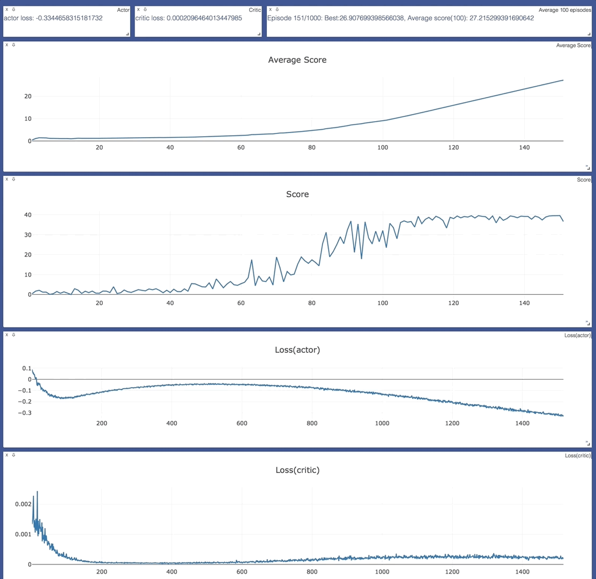
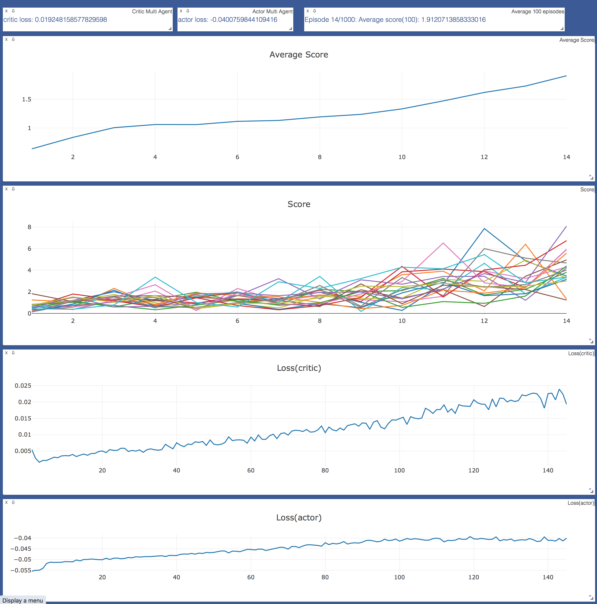

[//]: # (Image References)

[image1]: https://user-images.githubusercontent.com/10624937/43851024-320ba930-9aff-11e8-8493-ee547c6af349.gif "Trained Agent"


# Reacher: Continuous Control

### Introduction

In this project, we are challenged to solve [Reacher](https://github.com/Unity-Technologies/ml-agents/blob/master/docs/Learning-Environment-Examples.md#reacher) environment.

![Trained Agent][image1]

The environment, a double-jointed arm can move to target locations. A reward of +0.1 is provided for each step that the agent's hand is in the goal location. Thus, the goal of your agent is to maintain its position at the target location for as many time steps as possible.

The observation space consists of 33 variables corresponding to position, rotation, velocity, and angular velocities of the arm. Each action is a vector with four numbers, corresponding to torque applicable to two joints. Every entry in the action vector should be a number between -1 and 1.

### Solving the Environment

We use [deep deterministic policy gradients](https://arxiv.org/abs/1509.02971) (ddpg) to solve the environment using pytorch.

#### Option 1: Solve the First Version

The task is episodic, and in order to solve the environment,  the agent must get an average score of +30 over 100 consecutive episodes.

[Click here for solution](Report.md)

#### Option 2: Solve the Second Version

The barrier for solving the second version of the environment is slightly different, to take into account the presence of many agents.  In particular, the agents must get an average score of +30 (over 100 consecutive episodes, and over all agents).  Specifically,
- After each episode, we add up the rewards that each agent received (without discounting), to get a score for each agent.  This yields 20 (potentially different) scores.  We then take the average of these 20 scores. 
- This yields an **average score** for each episode (where the average is over all 20 agents).

The environment is considered solved, when the average (over 100 episodes) of those average scores is at least +30. 


### Getting Started

1. Clone this repo

2. Download the environment from one of the links below.  You need only select the environment that matches your operating system:

|Version|Binary|
|-------|-----|
|**_Version 1: One (1) Agent_**|[LINUX](https://s3-us-west-1.amazonaws.com/udacity-drlnd/P2/Reacher/one_agent/Reacher_Linux.zip), [LINUX-NO-VIZ](https://s3-us-west-1.amazonaws.com/udacity-drlnd/P2/Reacher/one_agent/Reacher_Linux_NoVis.zip), [MAC](https://s3-us-west-1.amazonaws.com/udacity-drlnd/P2/Reacher/one_agent/Reacher.app.zip), [WIN32](https://s3-us-west-1.amazonaws.com/udacity-drlnd/P2/Reacher/one_agent/Reacher_Windows_x86.zip)|[WIN64](https://s3-us-west-1.amazonaws.com/udacity-drlnd/P2/Reacher/one_agent/Reacher_Windows_x86_64.zip)|
|**_Version 2: Twenty (20) Agents_**|[LINUX](https://s3-us-west-1.amazonaws.com/udacity-drlnd/P2/Reacher/Reacher_Linux.zip),[LINUX-NO-VIZ](https://s3-us-west-1.amazonaws.com/udacity-drlnd/P2/Reacher/Reacher_Linux_NoVis.zip),  [MAC](https://s3-us-west-1.amazonaws.com/udacity-drlnd/P2/Reacher/Reacher.app.zip), [WIN32](https://s3-us-west-1.amazonaws.com/udacity-drlnd/P2/Reacher/Reacher_Windows_x86.zip), [WIN64](https://s3-us-west-1.amazonaws.com/udacity-drlnd/P2/Reacher/Reacher_Windows_x86_64.zip)|
    
(Use LINUX-NO-VIZ for training in headless mode)

2. Create a top level directory "env" and unzip the contents of the file inside env.

3. (Optional but recommended) create a conda environment
```
conda create -n myenv python=3.6
```

4. Install dependencies
```
conda activate myenv
pip install .
```

5. Install unity ml-agents using the [instructions](https://github.com/Unity-Technologies/ml-agents/blob/master/docs/Installation.md) here.


### Instructions

In order to train your agent, first start visdom 
```
conda activate myenv
visdom
```

Default command line arguments 
```
conda activate myenv
cd src
python trainer.py --help

usage: multitrainer.py [-h] [--num_episodes NUM_EPISODES] [--max_t MAX_T]
                       [--vis VIS] [--model MODEL] [--info INFO]
                       [--stop_on_solve STOP_ON_SOLVE]

optional arguments:
  -h, --help            show this help message and exit
  --num_episodes NUM_EPISODES
                        Total number of episodes to train (default: 1000)
  --max_t MAX_T         Max timestep in a single episode (default: 1000)
  --vis VIS             Whether to use visdom to visualise training (default:
                        True)
  --model MODEL         Model checkpoint path, use if you wish to continue
                        training from a checkpoint (default: None)
  --info INFO           Use this to attach notes to your runs (default: )
  --stop_on_solve STOP_ON_SOLVE
                        Stop as soon as the environment is solved (default:
                        True)
```

### Single Agent Training

Train a single agent environment, you'll need more steps per episode in single agent mode than multi agent.
```
conda activate myenv
cd src
python trainer.py
```

Open your web browser to view the realtime training plots @ http://127.0.0.1:8097

Every time you run the trainer, a new directory is created under src/runs with following contents:

* log file
* hyperparams.json : contains the configuration used 
* actor_losses.txt (actor_losses_multi.txt for 20 agents env): contains the loss for actor
* critic_losses.txt (critic_losses_multi.txt for 20 agents env): contains the loss for critic
* scores.txt : contains the entire score history
* scores_full.txt: Also contains the entire history but above file is updated at every episode so if you terminate before completing all episodes, this file will not be generated.
* checkpoint_actor.pth: Best weights for actor model
* checkpoint_critic.pth: Best weights for critic model

### Multi Agent Training

Train multi agent environment.

```
conda activate myenv
cd src
python multitrainer.py --num_episodes 250 --max_t 20
```

### Realtime Visualisation

Once you start training the agent, the realtime plots can be viewed at http://127.0.0.1:8097

#### Single Agent Training



#### Multi Agent Training



### Play

To use uploaded model checkpoints, use player.py

```
conda activate myenv
cd src
python player.py --help
usage: player.py [-h] [--env ENV] [--model MODEL] [--agent AGENT]

optional arguments:
  -h, --help     show this help message and exit
  --env ENV      Full path of environment (default: None)
  --model MODEL  Model checkpoint path, use if you wish to continue training
                 from a checkpoint (default: None)
  --agent AGENT  Number of agents. Specify either 1 or 20 (default: None)
```

For example, to run mac environment with model checkpoints
```
python player.py --env env/Reacher20.app --model checkpoint/single --agent 1
```
