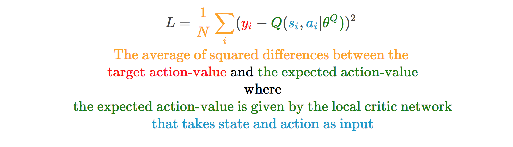
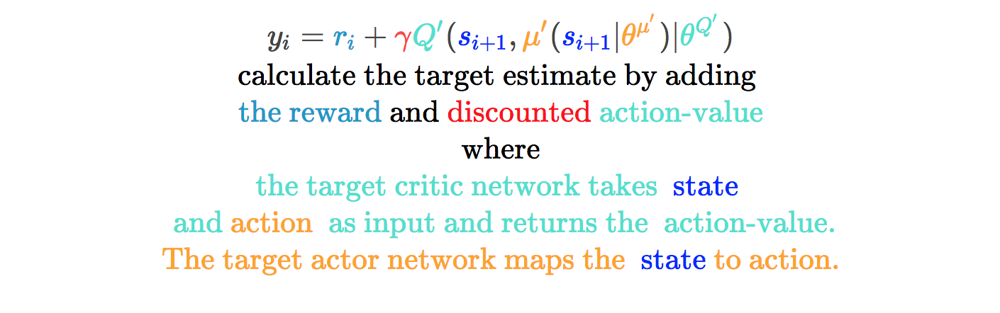
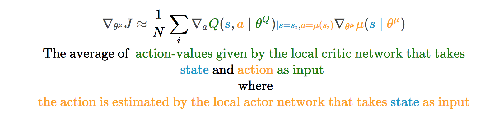
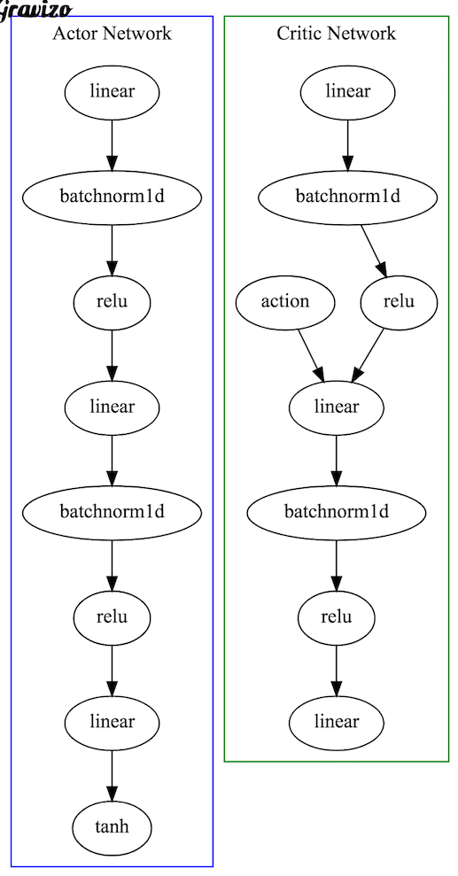
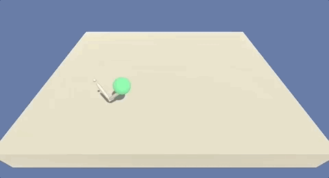
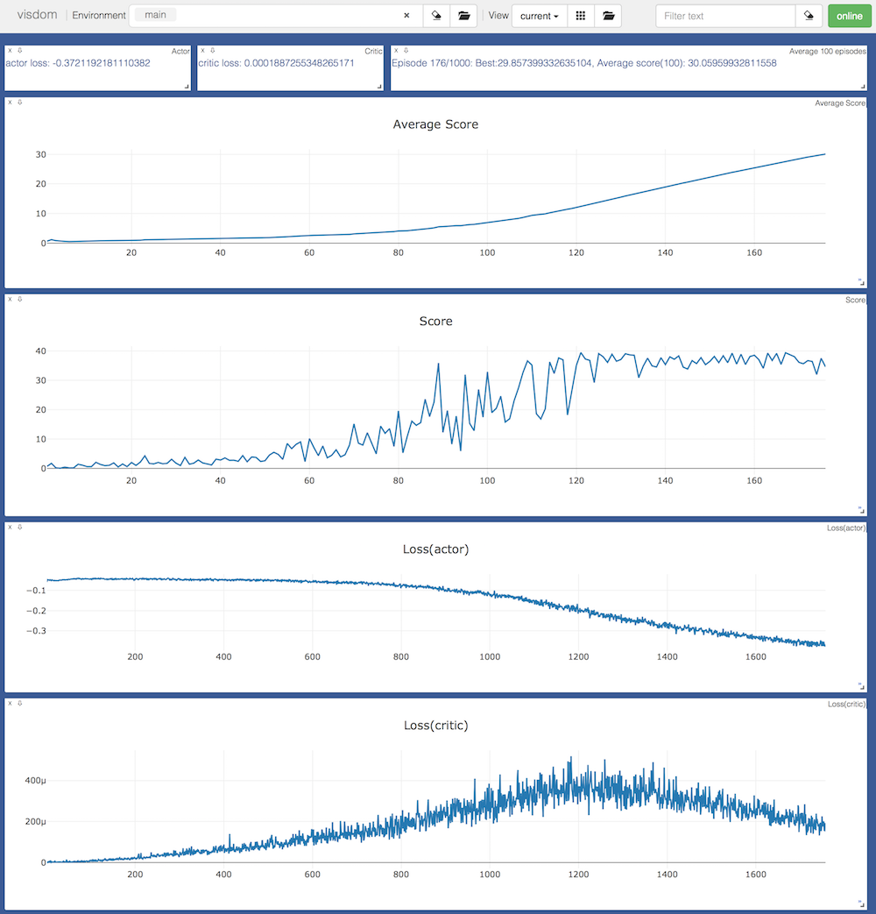

[//]: # (Image References)

[image1]: data/images/single_agent_avg_score_sm.png "single agent score"
[image2]: data/images/multi_agent_avg_score_sm.png "single agent score"

# Reacher

The Reacher environment requires the agent to learn from high dimensional state space and perform actions in continuous action space. 

The algorithm such as DQN can solve problems with high dimensional state space but only work on discrete and low-dimensional action spaces. The policy based methods such as REINFORCE can learn the policy to map state into actions but they are sample inefficient, noisy because we are sampling a trajectory (or a few trajectories) which may not truly represent the policy and could prematurely converge to local optima. 

The solution used in this repo makes use of actor-critic approach proposed by Lillicrap et al in deep deterministic policy gradient [paper](https://arxiv.org/abs/1509.02971).

The actor network takes state as input and returns the action whereas the critic network takes state and action as input and returns the value. 

The critic in this case is a DQN with local and fixed target networks and replay buffer. The local network is trained by sampling experiences from replay buffer and minimising the loss function.






The actor is updated using sampled policy gradient.




# Network Architecture

We use fully connected layers for both Actor and Critic network in pytorch 0.4.

<!--  batchnorm1 -> relu1;
    relu1 -> linear2  -> batchnorm2 -> relu2;
    relu2 -> linear3 -> tanh;
    label="Actor Network";
    color=blue;
     }
     linear1[label="linear"];
     batchnorm1[label="batchnorm1d"];
     relu1[label="relu"];
     linear2[label="linear"];
     batchnorm2[label="batchnorm1d"];
     relu2[label="relu"];
     linear3[label="linear"];
    subgraph cluster_critic {
    linearc1 -> batchnormc1 -> reluc1;
    reluc1 -> linearc2  -> batchnormc2 -> reluc2;
    action -> linearc2;
    reluc2 -> linearc3;
    label="Critic Network";
    color=green;
     }
     linearc1[label="linear"];
     batchnormc1[label="batchnorm1d"];
     reluc1[label="relu"];
     linearc2[label="linear"];
     batchnormc2[label="batchnorm1d"];
     reluc2[label="relu"];
     linearc3[label="linear"];
 }
'/> -->


# Hyper parameters

I tried several hyperparameters in order to solve the environment along with the ones specified by DDPG paper. In the end, the following worked the best.

|Parameter|Value|Description|
|---------|-----|-----------|
|BUFFER_SIZE|1e5|Replay memory buffer size|
|BATCH_SIZE|256|Minibatch size|
|GAMMA|0.9|Discount factor|
|TAU|1e-3|Soft update of target parameters|
|LR_ACTOR|1e-3|Actor learning rate|
|LR_CRITIC|1e-3|Critic learning rate|
|WEIGHT_DECAY|0|L2 weight decay|
|SCALE_REWARD|1.0|Reward scaling|
|SIGMA|0.01|OU Noise std|
|FC1|128|input channels for 1st hidden layer|
|FC2|128|input channels for 1st hidden layer|

The agent was trained for 1000 timesteps per episode.

# Performance

The single agent environment was solved in **176 episodes**.

![Single Agent][image1]

Watch the trained agent play by running the following script

```
python player.py --env ../env/Reacher_Linux1 --model ../checkpoint/single --agent 1
```



## Visdom Plot

The following screenshot from visdom shows the average score (shown above) and plot of over all score along with critic and actor losses. I found it very useful during the training phase when I was trying out various hyperparams.



## 20 Agent Environment (Optional)

Multi agent environment training is currently in progress and I think the environment will be solved in next 24 hours. I will update this page with a link to multi agent report and the repository with results and model checkpoints.

# Future Work

Some people were able to solve the environment in relatively fewer number of training episodes. I think a combination of following could help me reduce the training steps:

* reduce network size either by remove one hidden layer or decreasing the number of units as this would result in a lot less parameters.
* increase the learning rate and introduce weight decay (currently set to 0) to speed up the learning
* experiment with scaled rewards (see below)

This [paper](https://arxiv.org/abs/1604.06778) found that DDPG is less stable than batch algorithms such as REINFORCE and the performance of policy could degrade significantly during the training phase. In my tests, I found that average score hit a plateau if I continued the training process even after solving the environment. The paper suggests that scaling the rewards could improve the training stability.

While working on DDPG solution, there were a lot of moving parts such as network architecture, hyperparameters and it took be a long time, along with suggestions on the forum, to discover the combination that could solve the environment. Proximal policy optimization (PPO) has shown to achieve [state-of-the-art](https://blog.openai.com/openai-baselines-ppo/) results with very little hyperparamter tuning, greater sample efficiency while keeping the policy deviation under check (by forcing the ratio of old and new policy with in a small interval). 